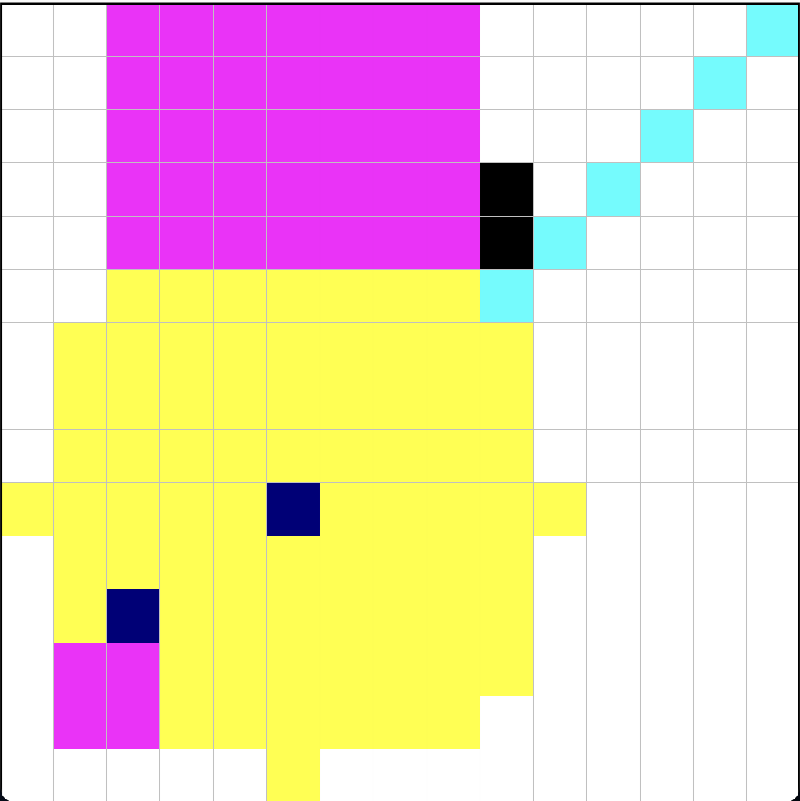

# Map2D Project

A Java implementation of a 2D map system with drawing, pathfinding, and file operations.

## Core Classes

### Map2D Interface

Defines the contract for 2D map operations:

- Basic operations: init, getPixel, setPixel, dimensions
- Drawing: circles, lines, rectangles
- Algorithms: shortest path, distance calculation, flood fill
- Map operations: add, multiply, rescale

### Map Class

Main implementation of Map2D interface:

- Stores data as `int[][]` array
- Implements all drawing and algorithm methods
- Uses BFS for pathfinding and distance calculations
- Supports both regular and cyclic map modes

### Pixel2D Interface

Represents a 2D coordinate point:

- `getX()`, `getY()` - coordinate access
- `distance2D()` - Euclidean distance calculation
- Standard `equals()` and `toString()` methods

### Index2D Class

Implementation of Pixel2D interface:

- Simple coordinate storage (x, y)
- Distance calculation using sqrt formula
- Copy constructor support

### Ex2_GUI Class

Graphics and file operations:

- `drawMap()` - Visual display using StdDraw
- `saveMap()` - Export maps to text files
- `loadMap()` - Import maps from text files



## Basic Usage

```java
// Create a map
Map map = new Map(10, 10, Color.WHITE.getRGB());

// Set pixels
Pixel2D point = new Index2D(5, 5);
map.setPixel(point, Color.BLACK.getRGB());

// Draw shapes
map.drawCircle(new Index2D(3, 3), 2.0, Color.RED.getRGB());
map.drawLine(new Index2D(0, 0), new Index2D(9, 9), Color.BLUE.getRGB());

// Find path
Pixel2D[] path = map.shortestPath(
    new Index2D(0, 0),
    new Index2D(9, 9),
    Color.BLACK.getRGB(),
    false
);

// Display
Ex2_GUI.drawMap(map);
```

## File Format

Text files store maps as:

```
width height
row1_pixels...
row2_pixels...
...
```

Example 3x3 map:

```
2 0 1
0 1 0
1 0 1
```

## Key Algorithms

- **BFS Pathfinding**: Finds shortest obstacle-avoiding paths
- **Distance Mapping**: Calculates distances from any starting point
- **Flood Fill**: Fills connected components with new colors
- **Cyclic Support**: Wraps around map boundaries when enabled

## Testing

```bash
java MapTest      # Tests Map class functionality
java Index2DTest  # Tests Index2D coordinate operations
```

---

_Intro2CS Exercise 2 - 2D Map Manipulation System_
